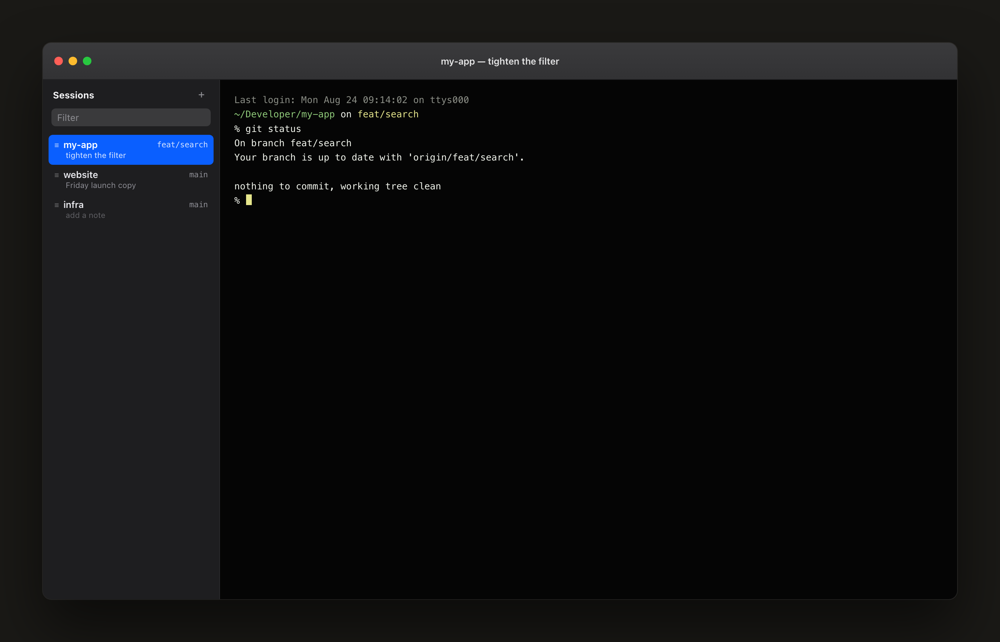

# Terminal Organizer

A Finder-style macOS app for people who keep a lot of terminals open.

The left sidebar is a list of sessions. Each row shows the folder, the git branch, and a short note for what that session is for. The right side is a real local shell. Other sessions keep running while you look at one.



Open source. Free. You build it on your Mac — there is no paid Apple Developer signing and no App Store listing.

**Install walkthrough:** clone this repo, then `open put-this-on-your-mac.html`.

Current release: **[1.3.8](https://github.com/jvjinfinity/terminal-organizer/releases/tag/v1.3.8)** · [Changelog](CHANGELOG.md)

## Requirements

- macOS 14 Sonoma or later
- Xcode 16 or later (Swift 6.2), or the matching Command Line Tools
- A network connection on first build (downloads [SwiftTerm](https://github.com/migueldeicaza/SwiftTerm))

## Install

```bash
xcode-select --install   # if you do not already have the tools
git clone https://github.com/jvjinfinity/terminal-organizer.git
cd terminal-organizer
./scripts/install.sh
```

That compiles a Release build, copies `/Applications/Terminal Organizer.app`, and opens it. The first build can take a few minutes.

If macOS blocks the app: Finder → Applications → Terminal Organizer → right-click → **Open**. You built it yourself; Gatekeeper is picky about ad-hoc signed apps.

## Update

```bash
cd terminal-organizer
git pull
./scripts/install.sh
```

Install replaces the running app. Live shells do not resume; folders and notes do.

## Keys

| Key | Action |
|---|---|
| ⌘N | New session in the current folder |
| ⌘⇧N | New session, pick a folder |
| ⌘D | Duplicate session |
| ⌘W | Close session (asks if a child process is running) |
| ⌘E | Edit the selected session’s note |
| ⌘F | Filter sessions |
| ⌘R | Restart shell |
| ⌘⇧R | Reveal in Finder |
| ⌘+/⌘-/⌘0 | Font size |
| ⌘1–9 | Jump to session |
| ⌘, | Settings |

Click **add a note** (or the existing note, or **⌘E**) to edit. Drag a row onto another to reorder, or **⌥⌘↑ / ⌥⌘↓**.

## Notifications (optional)

If you use [Grok](https://x.ai/cli), the app can ping you when Grok **needs input** or **just finished a turn**.

- Grok hooks: `permission_prompt`, and `Stop` only when the turn actually ended (`end_turn`)
- Window titles that say “action required” / “needs input”
- Click the Mac notification to jump to that session

Ordinary terminal bells and Grok’s idle timer do not send a Mac banner.

Allow notifications when macOS asks. Leave Grok’s `[ui.notifications] method` on `auto` (do not set `osc777`).

The sidebar works without Grok.

## Notes

Sessions persist as folders + notes in `~/Library/Application Support/Terminal Organizer/`. Live processes do not survive quit. Each Mac keeps its own list.

## License

[MIT](LICENSE). Terminal emulator: [SwiftTerm](https://github.com/migueldeicaza/SwiftTerm) (MIT).
